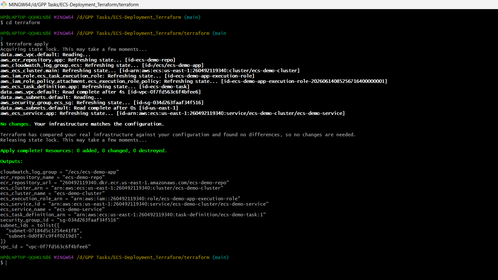
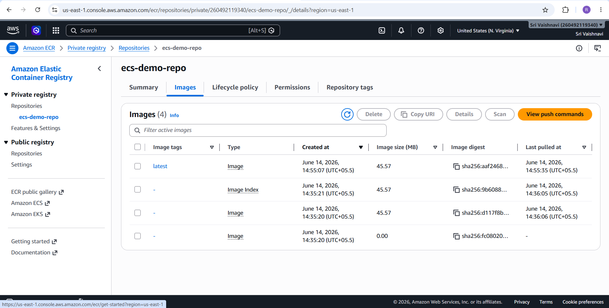
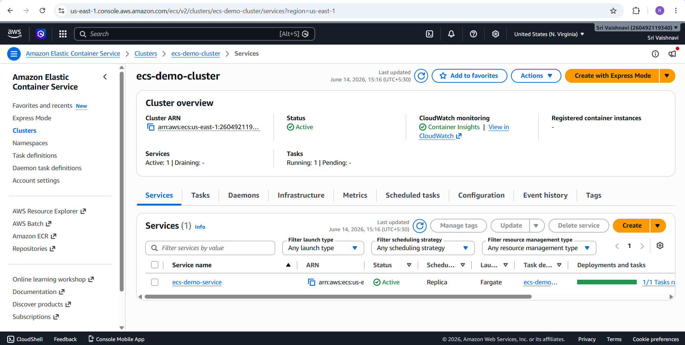
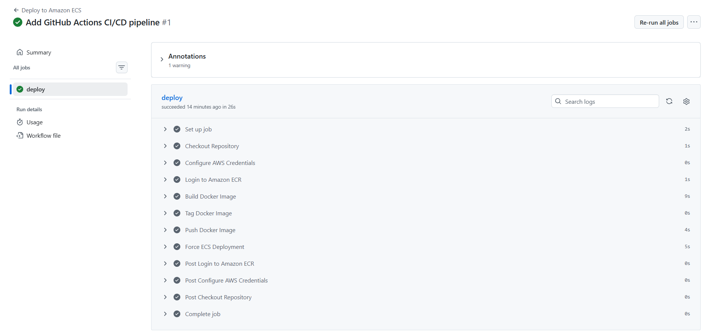
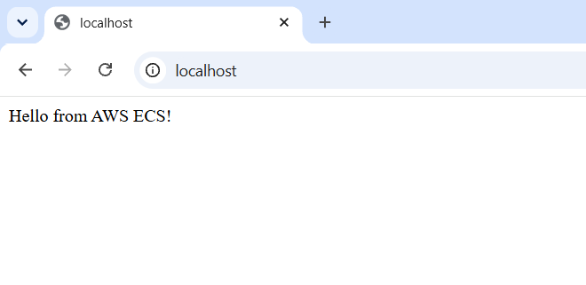

# Automate AWS ECS Deployment with Terraform and GitHub Actions

## Project Overview

This project demonstrates a complete end-to-end automated deployment pipeline for a containerized Node.js application on AWS using Terraform for Infrastructure as Code (IaC) and GitHub Actions for Continuous Integration and Continuous Deployment (CI/CD).

The project provisions AWS Elastic Container Registry (ECR) and AWS Elastic Container Service (ECS) infrastructure, builds and pushes Docker images automatically, and deploys the latest application version without manual intervention.

## Live Demo

👉 https://drive.google.com/file/d/12hFDSV3dIDo7DSKVTboByO1kLz9afb19/view?usp=sharing

## Architecture

```
Developer
    │
    │ git push
    ▼
GitHub Repository
    │
    ▼
GitHub Actions
    │
    ├── Checkout Source Code
    ├── Configure AWS Credentials
    ├── Build Docker Image
    ├── Login to Amazon ECR
    ├── Push Docker Image
    └── Update ECS Service
                │
                ▼
         Amazon ECS (Fargate)
                │
                ▼
          Containerized Application
                │
                ▼
          CloudWatch Logs
```


## Technology Stack
* Node.js
* Express.js
* Docker
* Terraform
* AWS ECS (Fargate)
* AWS ECR
* AWS CloudWatch
* AWS IAM
* AWS S3 Backend
* AWS DynamoDB State Locking
* GitHub Actions

## Project Structure
```
ECS-Deployment_Terraform/

├── app/
│   ├── index.js
│   ├── package.json
│   └── package-lock.json
│
├── terraform/
│   ├── backend.tf
│   ├── versions.tf
│   ├── variables.tf
│   ├── main.tf
│   └── outputs.tf
│
├── .github/
│   └── workflows/
│       └── main.yml
│
├── Dockerfile
├── docker-compose.yml
├── .env.example
├── README.md
└── .gitignore
```

## Features
* Infrastructure as Code using Terraform
* Remote Terraform State using Amazon S3
* Terraform State Locking using DynamoDB
* Multi-stage Docker Build
* Amazon ECR Repository
* Amazon ECS Cluster and Service
* CloudWatch Log Integration
* IAM Execution Role
* GitHub Actions CI/CD Pipeline
* Automatic Docker Image Deployment
* Health Check Endpoint
* Stateless REST API

## API Endpoints
### Root Endpoint
```
GET /
```

Response
```
Hello from AWS ECS!
```

### Health Endpoint
```
GET /health
```

Response
```
OK
```

### Unknown Route
Returns
```
404 Not Found
```

### Install Dependencies
```bash
cd app
npm install
```

### Run Application
```bash
npm start
```
Application will be available at
```
http://localhost:3000/
```

Health endpoint
```
http://localhost:3000/health
```

## Docker

### Build Docker Image
```bash
docker build -t ecs-demo-app .
```

### Run Docker Container
```bash
docker run -p 8080:80 ecs-demo-app
```

Open
```
http://localhost:8080/
```

Health endpoint
```
http://localhost:8080/health
```

## Docker Compose
### Start
```bash
docker compose up --build
```

### Stop
```bash
docker compose down
```

## AWS Resources
Terraform provisions the following resources:
* Amazon ECR Repository
* Amazon ECS Cluster
* Amazon ECS Service
* ECS Task Definition
* CloudWatch Log Group
* IAM Execution Role
* Security Group


## Terraform Backend
Terraform remote state configuration:
* S3 Bucket
* DynamoDB State Lock Table

State is stored remotely and locked during execution to prevent concurrent modifications.

## Terraform Commands
### Initialize
```bash
cd terraform
terraform init
```
### Format
```bash
terraform fmt
```
### Validate
```bash
terraform validate
```
### Plan
```bash
terraform plan
```
### Apply
```bash
terraform apply
```
### Destroy
```bash
terraform destroy
```

## GitHub Actions Pipeline
Pipeline executes automatically on every push to the main branch.
Stages:
1. Checkout Repository
2. Configure AWS Credentials
3. Login to Amazon ECR
4. Build Docker Image
5. Push Docker Image
6. Force ECS Deployment

## GitHub Secrets
Configure the following repository secrets:
```
AWS_ACCESS_KEY_ID
AWS_SECRET_ACCESS_KEY
```

## Environment Variables
Example `.env.example`
```
PORT=80
AWS_REGION=us-east-1
ECS_CLUSTER=ecs-demo-cluster
ECS_SERVICE=ecs-demo-service
ECR_REPOSITORY=ecs-demo-repo
CONTAINER_NAME=ecs-demo-container
```

## Verification Steps
### Local Verification
```
docker build -t ecs-demo-app .
docker run -p 8080:80 ecs-demo-app
```

Visit
```
http://localhost:8080/
http://localhost:8080/health
```

### Terraform Verification
```
terraform init
terraform validate
terraform plan
terraform apply
```

### Docker Verification
```
docker images
docker ps
```

### AWS Verification
Verify in AWS Console:
* ECR Repository
* ECS Cluster
* ECS Service
* CloudWatch Logs
* IAM Role

## Expected Outputs
Terraform outputs:
* ECR Repository URL
* ECS Cluster Name
* ECS Service Name
* ECS Task Definition ARN
* CloudWatch Log Group
* Security Group ID

## CI/CD Workflow
Every commit to the main branch automatically:
```
git push
      │
      ▼
GitHub Actions
      │
      ▼
Build Docker Image
      │
      ▼
Push Image to Amazon ECR
      │
      ▼
Force ECS Deployment
      │
      ▼
Application Updated
```

## Screenshots
### 1. Terraform Apply Output
Shows the successful creation of AWS infrastructure using Terraform.


### 2. AWS ECR Repository
Amazon Elastic Container Registry repository created for storing Docker images.


### 3. AWS ECS Service
Running ECS service managing the application containers.


### 4. GitHub Actions CI/CD Pipeline
Successful GitHub Actions workflow for automated build and deployment.


### 5. Running Application
Application successfully deployed and accessible.
